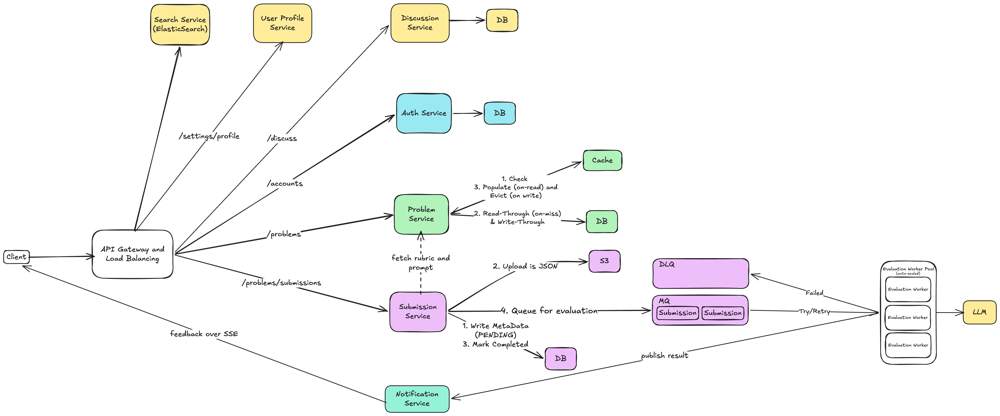
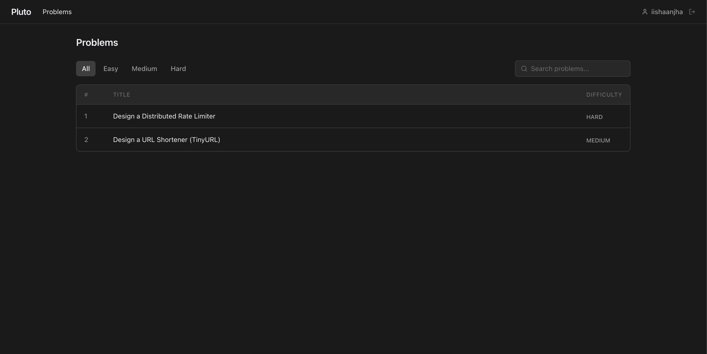
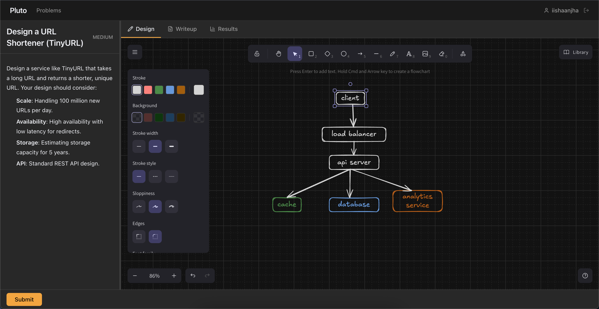
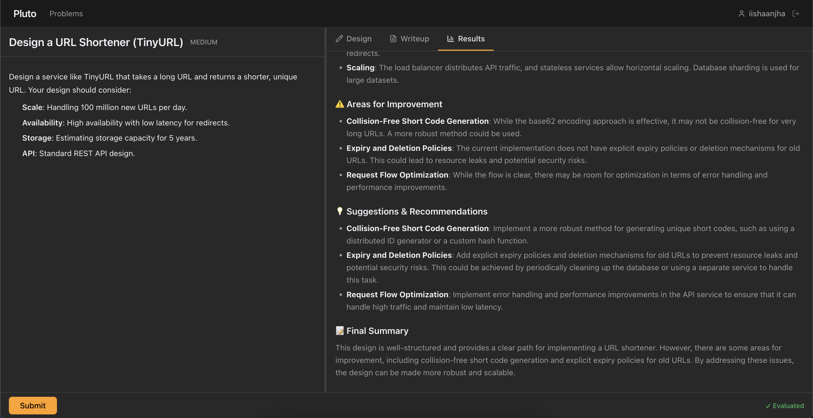
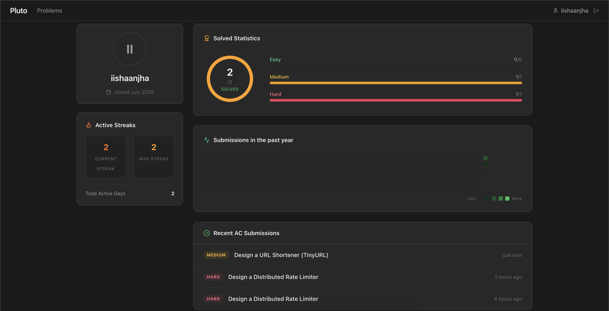

# Pluto

A full-stack system design practice platform built with a microservices architecture. Users can browse curated high-level design (HLD) problems, sketch architecture diagrams in an embedded whiteboard, write design explanations, and receive structured feedback generated by a locally hosted large language model.



---

## Table of Contents

- [Overview](#overview)
- [Features](#features)
- [Architecture](#architecture)
- [Technology Stack](#technology-stack)
- [Services](#services)
- [Screenshots](#screenshots)
- [Project Structure](#project-structure)
- [Getting Started](#getting-started)

---

## Overview

Pluto is a purpose-built web application for practicing system design interviews. It takes direct inspiration from how platforms like LeetCode structure algorithmic problems, but applies the same workflow to high-level system design: present a problem, provide a workspace, and deliver automated evaluation.

The core interaction loop is straightforward. A user selects a design problem, draws an architecture diagram using an integrated Excalidraw canvas, writes a short explanation of their design decisions, and submits. The submission is persisted to object storage, queued via a message broker, and asynchronously evaluated by a service that parses the diagram into a semantic text representation and sends it to a local LLM (Ollama) for structured feedback.

---

## Features

- **Problem Catalogue** -- Browse system design problems filtered by difficulty (Easy, Medium, Hard) with full-text search.
- **Interactive Workspace** -- A split-pane editor with the problem description on the left and a tabbed workspace on the right containing the diagram canvas, a writeup editor, and the results panel.
- **Embedded Whiteboard** -- An integrated Excalidraw editor for drawing architecture diagrams directly in the browser.
- **LLM-Powered Evaluation** -- Submitted diagrams are parsed from Excalidraw JSON into a semantic component-and-connection representation, combined with the user's written explanation, and evaluated by a local LLM against the problem's rubric.
- **Asynchronous Processing** -- Submissions are queued via RabbitMQ and processed by evaluation workers, with results polled and displayed upon completion.
- **User Profiles** -- Dedicated profile pages showing solved statistics by difficulty, submission activity heatmaps, active streaks, and a history of recent accepted submissions.
- **Authentication** -- JWT-based authentication with Spring Security, enforced at the API gateway layer.
- **Caching** -- Redis-backed read-through and write-through caching on the problem service to reduce database load.

---

## Architecture

The platform follows a microservices architecture where each domain concern is isolated into its own independently deployable service. All client-facing traffic is routed through a Spring Cloud Gateway that handles CORS, request routing, and JWT validation for protected endpoints.

The submission pipeline is the most architecturally involved flow:

1. The client submits an Excalidraw diagram (JSON) and a written explanation.
2. The Submission Service stores the diagram JSON in S3-compatible object storage and writes submission metadata (status: PENDING) to PostgreSQL.
3. The submission is published to a RabbitMQ queue.
4. An Evaluation Worker consumes the message, retrieves the diagram from storage, parses the Excalidraw JSON into a structured text representation of components and connections, builds an evaluation prompt, and sends it to a locally hosted Ollama LLM.
5. The LLM returns structured feedback, which is persisted back to the database and the submission is marked as COMPLETED.
6. The client polls for the result and renders the feedback as formatted Markdown.

A dead-letter queue (DLQ) handles failed evaluation attempts with retry semantics.

---

## Technology Stack

| Layer | Technologies |
| --- | --- |
| Frontend | React 19, Vite, Tailwind CSS, React Router, Excalidraw, React Markdown |
| Backend Services | Java 17, Spring Boot (3.2 / 4.1), Spring Cloud Gateway, Spring Data JPA, Spring Security, Spring AMQP |
| Evaluation Service | Python, FastAPI, Pydantic, httpx |
| Databases | PostgreSQL (per-service), Redis (caching) |
| Message Broker | RabbitMQ |
| Object Storage | S3-compatible (AWS SDK) |
| LLM Runtime | Ollama (Llama 3.1 8B) |
| Auth | JWT (jjwt) |

---

## Services

| Service | Responsibility |
| --- | --- |
| **Gateway Service** | API routing, CORS, JWT filter |
| **Auth Service** | User registration, login, JWT issuance |
| **Problem Service** | CRUD for design problems, Redis caching |
| **Submission Service** | Submission persistence, S3 upload, RabbitMQ publishing |
| **User Profile Service** | Profile data, solved stats, streaks, activity |
| **Discussion Service** | Threaded discussions per problem |
| **Evaluation Service** | Excalidraw parsing, LLM prompt construction, evaluation |

---

## Screenshots

### Problem List

The landing page displays all available system design problems with difficulty badges and search filtering.



### Design Workspace

A split-pane workspace with the problem description on the left and the Excalidraw whiteboard on the right. Users draw their architecture diagrams directly in the browser.



### Evaluation Results

After submission, the LLM returns structured feedback covering strengths, areas for improvement, concrete suggestions, and a final summary.



### User Profile

Profile pages display solved statistics broken down by difficulty, a GitHub-style submission heatmap, current and max streaks, and a list of recent accepted submissions.



---

## Project Structure

```
Pluto/
  apps/
    client/                  # React frontend (Vite)
  services/
    gateway-service/         # Spring Cloud Gateway
    auth-service/            # Authentication (JWT + Spring Security)
    problem-service/         # Problem CRUD + Redis caching
    submission-service/      # Submissions, S3, RabbitMQ producer
    user-profile-service/    # User profiles and statistics
    discussion-service/      # Problem discussions
    evaluation-service/      # Python FastAPI, Excalidraw parser, LLM evaluation
  docs/
    screenshots/             # Application screenshots
    design.excalidraw        # Architecture diagram source
```

---

## Getting Started

### Prerequisites

- Java 17 and Maven
- Node.js 18+ and npm
- Python 3.11+
- PostgreSQL
- Redis
- RabbitMQ
- Ollama with `llama3.1:8b` pulled locally

### Running the Services

Each backend service is started independently from its directory:

```bash
# Gateway
cd services/gateway-service && mvn spring-boot:run

# Auth
cd services/auth-service && mvn spring-boot:run

# Problems
cd services/problem-service && mvn spring-boot:run

# Submissions
cd services/submission-service && mvn spring-boot:run

# User Profiles
cd services/user-profile-service && mvn spring-boot:run

# Evaluation (Python)
cd services/evaluation-service && python main.py
```

### Running the Frontend

```bash
cd apps/client
npm install
npm run dev
```

The client runs at `http://localhost:5173` and communicates with the backend through the gateway at `http://localhost:8000`.

---
